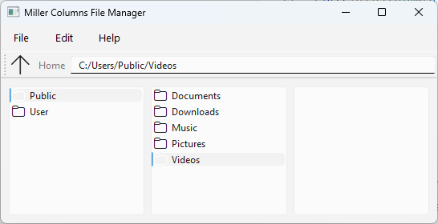

# Miller



Miller Columns File Manager ("Miller") is a simple cross-platform file manager written in PyQt6 that provides a file management interface based on the [Miller Columns](https://en.wikipedia.org/wiki/Miller_columns) concept.

## Features

- **Column File Navigation**: Navigate through directories using a column-based interface.
- **Context Menus**: Right-click on files and folders to access context-sensitive actions.
- **Toolbar**: Quickly navigate to the parent directory, home directory, and view the current directory path.
- **Platform Support**: Basic support for platform-specific context menus (currently implemented for Windows).

## Getting Started

### Prerequisites

- Python 3.x
- PyQt6
- pywin32 (for Windows platform integration)

### Installation

1. Clone the repository:

   ```sh
   git clone https://github.com/probonopd/Miller
   cd Miller
   ``` 

2. Install dependencies:

   ```
   pip install -r requirements.txt
   ```

### Usage

```
python miller.py
```

* Use the toolbar buttons to navigate (Up, Home) and view the current directory path.
* Click on folders to navigate deeper into the directory structure.
* Double-click on folders to open them in Windows Explorer.
* Right-click on files or folders to access context menu actions.

### Contributing

Contributions are welcome! Please fork the repository and submit a pull request with your improvements.

### License

This project is licensed under the MIT License - see the [LICENSE](LICENSE) file for details.

### Acknowledgments

- PyQt6 Documentation: https://doc.qt.io/qtforpython-6/
- Windows platform integation: https://github.com/mhammond/pywin32
